# ✦ Jordan Brand — E-Commerce Platform

A full-stack e-commerce web application inspired by the Jordan Brand. Customers can browse, buy, and return products — shoes, clothing, and accessories. Admins get a complete dashboard to manage products, orders, and the home page.

---

## 🚀 Live Demo

> Run locally — see [Getting Started](#getting-started) below.

---

## 📸 Screenshots

### 🏠 Home Page

**Hero Section & Navigation**
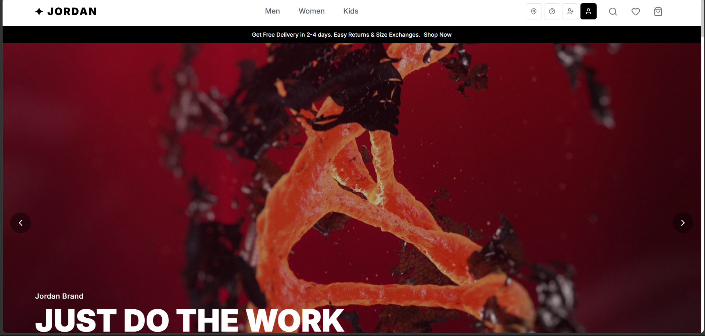
> Full-screen hero video/image carousel with animated transitions, mega dropdown navigation for Men / Women / Kids, and a top announcement banner.

**Featured & Category Sections**
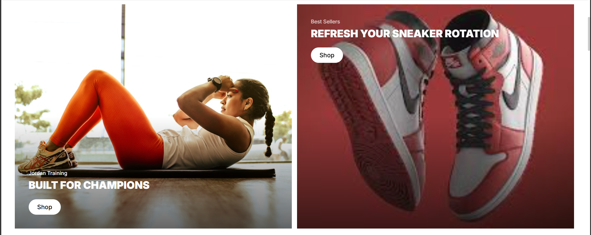
> Featured product split-layout, "Shop by Style" horizontal scroll cards, and "The Essentials" 3-column gender grid — all dynamically populated from the product database.

**Spotlight & Gear Up**
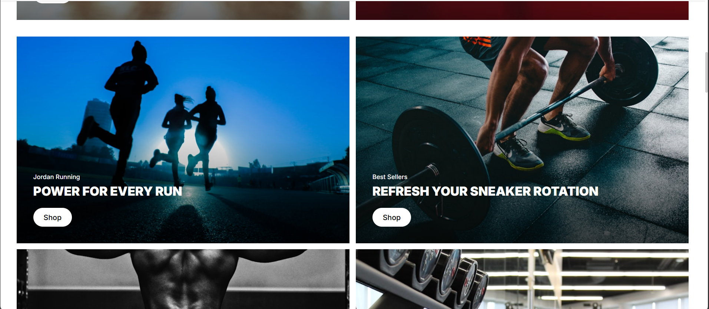
> 16-item spotlight icon grid for quick category navigation, and a "Gear Up" clothing section showing the latest apparel.

**App Banner**
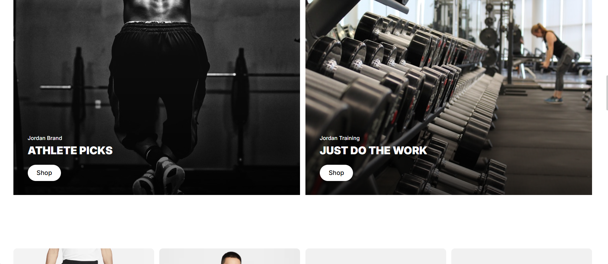
> Jordan app promotional banner with QR code at the bottom of the home page.

---

### 🛍️ Products & Product Detail

**Products Listing Page**
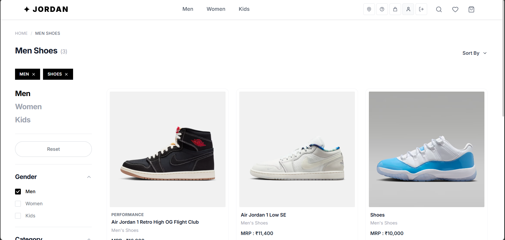
> Full product grid with sidebar filters — filter by gender, type (shoes/clothing/accessories), price range, and tags. Sort by featured, newest, or price.

**Product Detail Page**
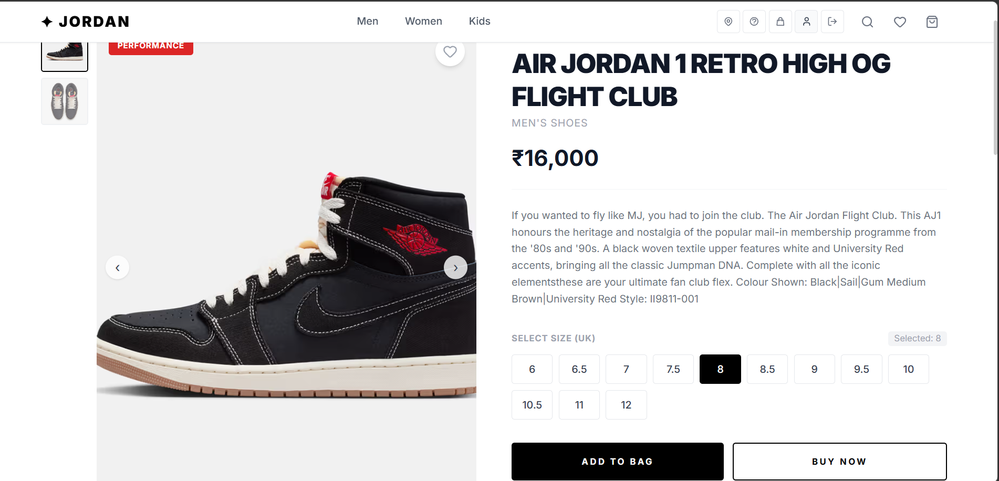
> Image gallery with thumbnail selector, size picker, add-to-cart button, wishlist toggle, related products, and a customer reviews section with star ratings and photo uploads.

---

### 🛒 Shopping Bag

**Your Bag**

> Cart page showing all added items with product image, name, size, and price. Order summary with free delivery and checkout button.

---

### 📦 Checkout Flow

**Delivery Details**
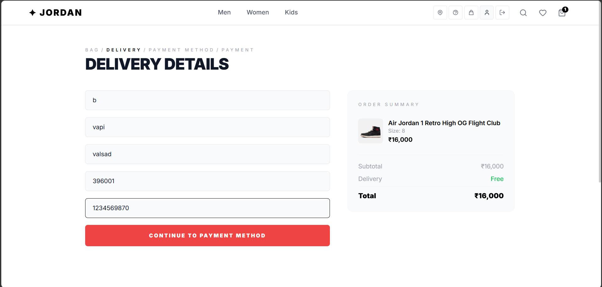
> Step 1 of checkout — customer fills in full name, address, city, pincode, and phone number. Auto-fills from saved profile if logged in.

**Payment Method Selection**

> Step 2 — customer chooses between **Online Payment** (Stripe — card, UPI, net banking) or **Cash on Delivery**.

**Online Payment — Stripe**

> Stripe Elements payment form with card input, fully themed to match the site design.


> Payment processing state with SSL encryption notice.

**Cash on Delivery Confirmation**

> COD confirmation screen showing the amount to keep ready, delivery instructions, and a confirm order button.

**Order Placed**

> Success page shown after a successful payment or COD confirmation.

---

### 📋 Order Tracking & Returns

**Track Order**

> My Orders page showing order status with a visual progress tracker (Confirmed → Processing → Shipped → Delivered), estimated delivery date, and item details.

**Store Locations**

> Store locator section accessible from the navbar.

---

### ⚙️ Admin Panel

**Admin Dashboard**
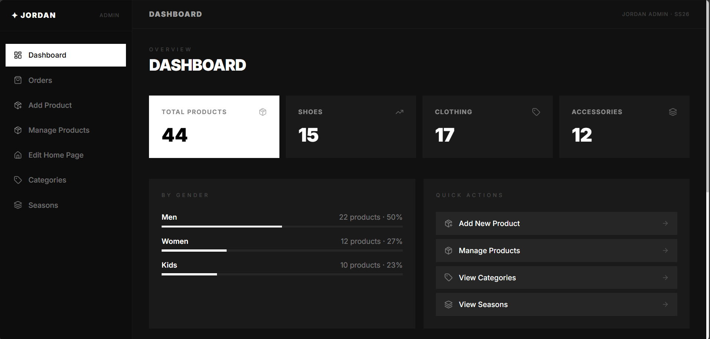
> Overview with stat cards — total products, shoes, clothing, accessories. Gender breakdown with progress bars and quick action links.

**Add Product**
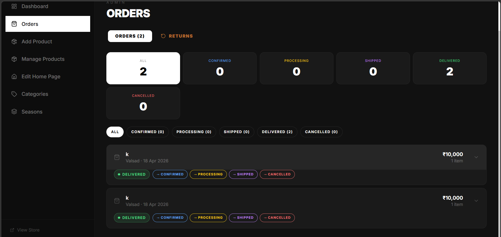
> Form to add new products with image upload (file or URL), multiple additional images, gender/type/tag/season selection, and auto-assigned sizes.

**Manage Products**
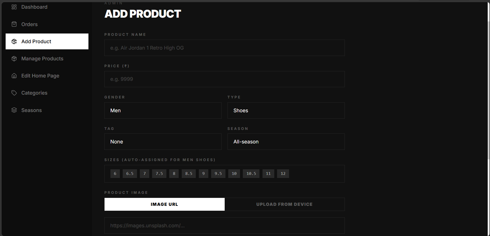
> Table view of all products with search and filters. Edit any product in a modal or delete it.

**Order Management**

> Orders tab with color-coded status badges. Admin can move any order through the pipeline (Confirmed → Processing → Shipped → Delivered → Cancelled) with one click.

**Admin Orders View**
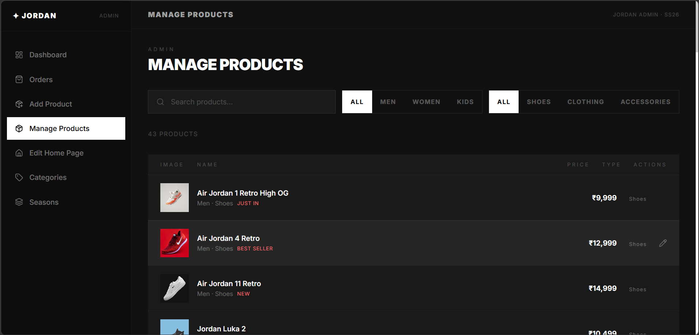
> Expanded order details showing delivery address, items, total, and payment method badge (Online / Cash on Delivery).

**Returns Management**
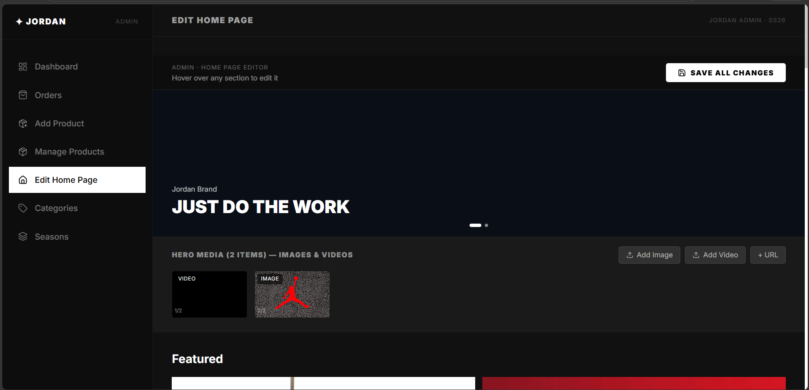
> Dedicated Returns tab showing all pending return requests as prominent orange cards. Customer's reason is always visible. Admin approves or rejects with one click.

**Categories View**
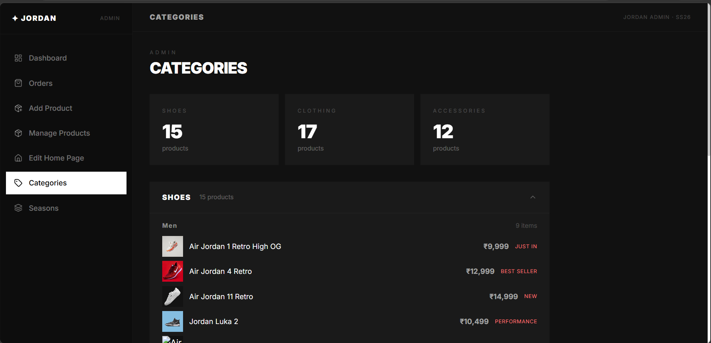
> Products grouped by type (shoes, clothing, accessories) with gender sub-breakdown.

**Home Page Editor**
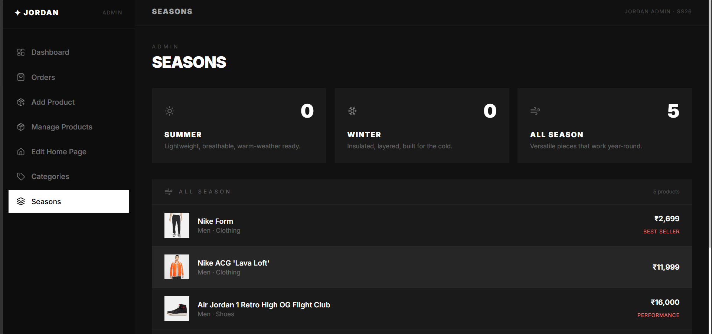
> Visual editor to customize the home page — hero banner text, hero media carousel, featured section images, spotlight items, and section titles. No code required.

---

## ✨ Features

### Customer
- 🔐 Sign up / Log in with JWT authentication
- 🏠 Dynamic home page with hero carousel, featured products, category sections
- 🔍 Product browsing with filters (gender, type, price, tags) and sorting
- 🖼️ Product detail with image gallery, size selector, and reviews
- ❤️ Wishlist to save favourite products
- 🛒 Shopping cart with add/remove
- 📦 3-step checkout: Delivery → Payment Method → Pay
- 💳 Online payment via **Stripe** (card, UPI, net banking)
- 🚚 Cash on Delivery option
- 📋 Order tracking with live status progress bar
- 🔄 **7-day return policy** — request a return with reason selection
- ⭐ Product reviews with star rating and photo upload
- 👤 Profile management with avatar upload

### Admin
- 📊 Dashboard with product stats and gender breakdown
- ➕ Add products with image upload, sizes, tags, seasons
- ✏️ Edit and delete products
- 📦 Order management — update status with one click
- 🔄 Return request management — approve or reject
- 🗂️ Category and season views
- 🎨 Home page editor — customize banners, hero media, spotlight

---

## 🛠️ Tech Stack

| Layer | Technology |
|---|---|
| Frontend | React 19, Vite |
| Routing | React Router v7 |
| Styling | Tailwind CSS |
| Icons | Lucide React |
| Payments | Stripe (React Stripe.js) |
| Backend | Node.js, Express.js 5 |
| Database | MongoDB + Mongoose |
| Auth | JWT + bcryptjs |
| File Uploads | Multer |

---

## 📁 Project Structure

```
├── src/                        # Frontend (React + Vite)
│   ├── pages/                  # Customer pages (Home, Products, Cart, Checkout...)
│   ├── admin/                  # Admin panel (separate Vite build)
│   │   ├── pages/              # Dashboard, AddProduct, Orders, Returns...
│   │   └── components/         # AdminLayout, AdminSidebar
│   ├── components/             # Navbar, Footer, ShoeCard, ProtectedRoute
│   ├── services/               # API fetch helpers
│   ├── *Context.jsx            # Auth, Cart, Wishlist, Theme contexts
│   └── App.jsx                 # Routes + providers
│
├── server/                     # Backend (Express + MongoDB)
│   ├── routes/                 # auth, products, orders, reviews, upload, homeSettings
│   ├── models/                 # User, Product, Order, Review
│   ├── middleware/             # JWT auth middleware
│   ├── uploads/                # Uploaded product images
│   └── homeData.json           # Persisted home page config
│
├── public/                     # Static assets (hero video, icons)
├── screenshots/                # Project screenshots
├── vite.config.js              # Frontend Vite config
└── vite.admin.config.js        # Admin panel Vite config (port 5174)
```

---

## ⚙️ Getting Started

### Prerequisites
- Node.js 18+
- MongoDB running locally
- Stripe account (for payments)

### 1. Clone the repository
```bash
git clone https://github.com/Kill826/Nike-E-Commerce-Site.git
cd Nike-E-Commerce-Site
```

### 2. Install frontend dependencies
```bash
npm install
```

### 3. Install backend dependencies
```bash
cd server
npm install
cd ..
```

### 4. Set up environment variables

Create `.env` in the **project root**:
```env
VITE_STRIPE_PUBLISHABLE_KEY=pk_test_your_stripe_publishable_key
```

Create `server/.env`:
```env
MONGO_URI=mongodb://localhost:27017/jordan-store
STRIPE_SECRET_KEY=sk_test_your_stripe_secret_key
JWT_SECRET=your_jwt_secret_key
ADMIN_SECRET_KEY=your_admin_secret_key
PORT=4000
```

### 5. Start the backend
```bash
cd server
npm run dev
```

### 6. Start the frontend
```bash
# Customer storefront (port 5173)
npm run dev

# Admin panel (port 5174) — open in a separate terminal
npm run admin
```

### 7. Open in browser
| App | URL |
|---|---|
| Customer Store | http://localhost:5173 |
| Admin Panel | http://localhost:5174 |
| Backend API | http://localhost:4000 |

---

## 🔑 Creating an Admin Account

During signup, pass the `adminKey` matching your `ADMIN_SECRET_KEY` env variable. Regular signups without this key get the `user` role automatically.

---

## 🔌 API Endpoints

| Method | Endpoint | Description |
|---|---|---|
| POST | `/api/auth/signup` | Register new user |
| POST | `/api/auth/login` | Login |
| GET | `/api/auth/me` | Get current user |
| PUT | `/api/auth/profile` | Update profile + avatar |
| GET | `/api/products` | List products (filter: gender, type) |
| GET | `/api/products/:id` | Single product |
| POST | `/api/products` | Create product |
| PUT | `/api/products/:id` | Update product |
| DELETE | `/api/products/:id` | Delete product |
| POST | `/api/orders` | Place order |
| GET | `/api/orders` | All orders (admin) |
| GET | `/api/orders/my/:userId` | User's orders |
| PATCH | `/api/orders/:id/status` | Update order status |
| POST | `/api/orders/:id/return` | Request return (7-day window) |
| PATCH | `/api/orders/:id/return/review` | Approve/reject return |
| GET | `/api/reviews/:productId` | Get product reviews |
| POST | `/api/reviews/:productId` | Submit review |
| POST | `/api/upload` | Upload single image |
| POST | `/api/upload/multiple` | Upload multiple images |
| GET | `/api/home-settings` | Get home page config |
| PUT | `/api/home-settings` | Update home page config |
| POST | `/api/payment-intent` | Create Stripe payment intent |

---

## 🗄️ Database Models

### User
```
name, email, password (hashed), role (user/admin),
avatar, phone, address, city, pincode
```

### Product
```
name, price, image, images[], gender (men/women/kids),
type (shoes/clothing/accessories), category, tag,
season (summer/winter/all-season), sizes[], description
```

### Order
```
items[], total, delivery { name, address, city, pincode, phone },
paymentIntentId, paymentMethod (online/cod), userId, 
status (confirmed/processing/shipped/delivered/cancelled/return_requested/returned),
returnRequest { requestedAt, reason, approved }
```

### Review
```
productId, userId, userName, rating (1-5), message, image
```

---

## 🔒 Security

- Passwords hashed with **bcrypt** (10 salt rounds)
- JWT tokens expire after **7 days**
- Admin role requires a **secret key** at signup
- File uploads validated for image MIME type and 5MB size limit
- `.env` files excluded from version control

---

## 👨‍💻 Author

**Kill826** — [GitHub](https://github.com/Kill826)

---

## 📄 License

This project is for educational purposes.
